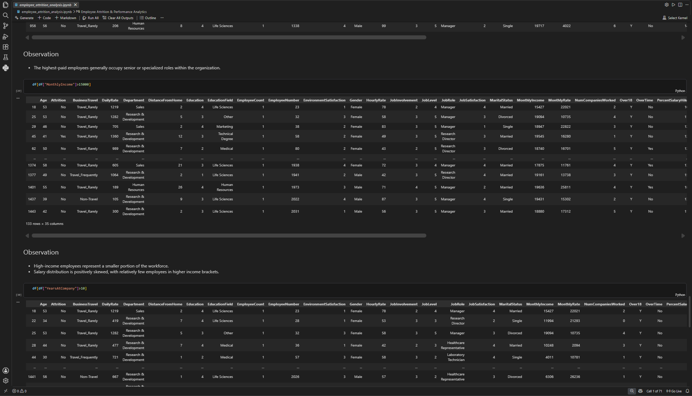
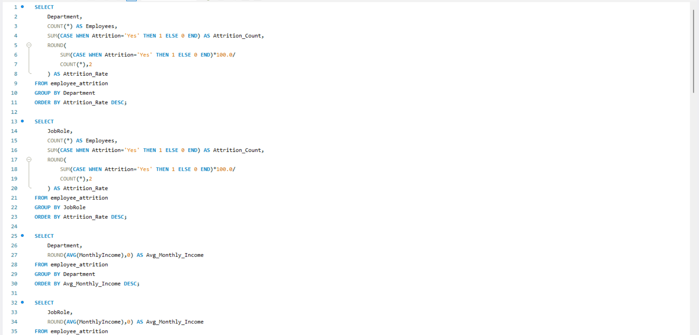

# 📊 Employee Attrition Analytics

## Project Overview

Employee attrition is one of the biggest challenges organizations face, as high turnover leads to increased recruitment costs, reduced productivity, and lower employee morale. This project analyzes the IBM HR Analytics Employee Attrition dataset to identify the key factors influencing employee attrition and provide actionable insights to improve employee retention.

The project demonstrates an end-to-end data analytics workflow using **Excel, SQL, Python, and Power BI**, covering data cleaning, exploratory data analysis (EDA), SQL-based business analysis, and interactive dashboard creation.

---

## Business Problem

The objective of this project is to answer important HR business questions, including:

- What is the overall employee attrition rate?
- Which department has the highest attrition?
- Which job roles are most affected?
- Does overtime increase attrition?
- How does monthly income influence employee turnover?
- Which age groups have the highest attrition?
- How do job satisfaction and work-life balance affect employee retention?

---

## Dataset

**Dataset:** IBM HR Analytics Employee Attrition Dataset

- **Total Employees:** 1470
- **Features:** 35
- **Target Variable:** Attrition

---

## 🛠️ Tech Stack

- Microsoft Excel
- MySQL
- Python
- Jupyter Notebook
- Pandas
- NumPy
- Matplotlib
- Seaborn
- Power BI
- Git & GitHub

---

# 📂 Project Structure

```text
Employee-Attrition-Analytics/
│
├── data/
├── excel/
├── powerbi/
├── python/
├── sql/
├── images/
│   ├── dashboard.png
│   ├── python_visuals.png
│   └── sql_queries.png
│
├── README.md
├── requirements.txt
└── .gitignore
```

---

# 🔄 Project Workflow

1. Data Collection
2. Data Cleaning
3. Exploratory Data Analysis (Excel)
4. SQL Business Analysis
5. Python Data Analysis
6. Dashboard Development (Power BI)
7. Business Insights & Recommendations

---

# 📈 Dashboard Preview

## Overall Dashboard

> *(Replace this image with your dashboard screenshot.)*


---

## Python Analysis

> *(Replace this image with your Python charts screenshot.)*



---

## SQL Analysis

> *(Replace this image with your SQL queries/results screenshot.)*



---

# 📊 SQL Analysis

The SQL phase focused on answering key HR business questions:

- Overall Attrition Rate
- Department-wise Attrition
- Job Role Analysis
- Overtime Analysis
- Monthly Income Comparison
- Gender Distribution
- Marital Status Analysis
- Age Group Analysis
- Business Travel Analysis
- Education Field Analysis
- Window Functions & Ranking

---

# 🐍 Python Analysis

Python was used for:

- Data Cleaning
- Exploratory Data Analysis (EDA)
- Correlation Analysis
- Feature Engineering
- Data Visualization
- Statistical Insights
- Business Interpretation

### Libraries Used

- Pandas
- NumPy
- Matplotlib
- Seaborn

---

# 💡 Key Insights

- Employees working overtime were significantly more likely to leave the organization.
- Certain job roles contributed disproportionately to overall attrition.
- Younger employees showed higher attrition rates.
- Lower-income employees had comparatively higher turnover.
- Job satisfaction and work-life balance played an important role in employee retention.

---

# 🚀 Future Improvements

- Build a Machine Learning model to predict employee attrition.
- Deploy the project as an interactive web application.
- Automate the ETL pipeline.
- Integrate real-time HR data.
- Develop predictive dashboards for workforce planning.

---

# 👨‍💻 Author

**Rahul Halvadiya**

B.Tech Information Technology

Aspiring Data Analyst

### Skills

- SQL
- Python
- Excel
- Power BI
- Data Visualization
- Business Analytics

---

# ⭐ If you found this project useful, consider giving it a star!
